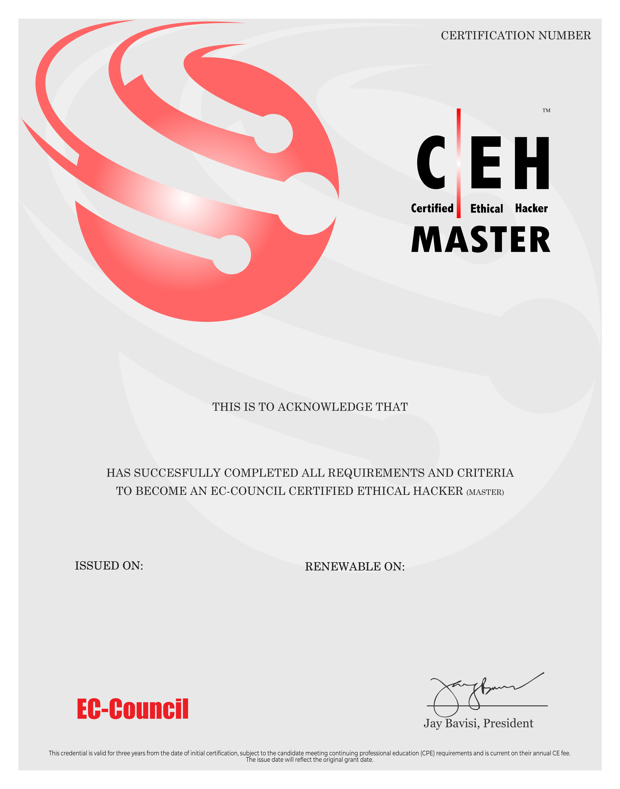

<div align="center">

[](https://git.io/typing-svg)


研究弱點、守住系統，也用程式把資安工作做得更快、更準。<br>
I investigate vulnerabilities, strengthen defenses, and automate security workflows.

[](https://eric-s-dev-site.kuanlin.pro/)
[](mailto:goole910805@gmail.com)
[](https://ithelp.ithome.com.tw/users/20171891/ironman/8352)
[](https://github.com/and910805)

</div>

---

## About Me

```console
eric@security-lab:~$ whoami
莊冠霖 / Eric Zhuang — Cybersecurity Engineer

eric@security-lab:~$ cat focus.txt
Vulnerability Research | CVE Coordination | Detection & Response | ISMS

eric@security-lab:~$ ./build.sh
Security Automation | Dashboards | Attack Simulation | AI Security
```

我是一名資安工程師，具備弱點研究與 CVE 協調、ISO 27001／ISMS、端點偵測與回應，以及企業資安維運經驗。我習慣同時站在攻擊者與防禦者的角度思考，並用 Python 將繁瑣流程變成可重複、可追蹤的自動化工具。

I'm a cybersecurity engineer with hands-on experience in vulnerability research and CVE coordination, ISO 27001/ISMS, endpoint detection and response, and enterprise security operations. I combine an attacker's perspective with a defender's discipline—and use Python to turn repetitive work into reliable, traceable automation.

## What I Do

- **Vulnerability Research** — Analyze and validate vulnerabilities, coordinate remediation, and support responsible CVE disclosure.
- **Security Operations** — Monitor and manage Firewall, EDR, AV, Exchange, and security events; improve detection and response workflows.
- **Security Governance** — Support ISO 27001 and ISMS operations, including risk assessments, audits, policies, and remediation tracking.
- **Attack-Informed Defense** — Apply MITRE ATT&CK, vulnerability scanning, and controlled attack simulations to strengthen defensive controls.
- **Security Automation** — Build Python tools and dashboards that turn raw security data into actionable insights.

## Featured Work

### Nessus Vulnerability Dashboard

Built an interactive **Python + Streamlit** dashboard that transforms Nessus scan results into clear views by CVSS severity and time range, making remediation progress easier to track and communicate.

### MITRE ATT&CK — APT29 Simulation

Designed a controlled attack path based on **APT29 techniques**, covering credential access, lateral movement, and persistence to support detection-rule validation and incident-response exercises.

### Adversarial AI Security Research

Used the **Adversarial Robustness Toolbox** to generate adversarial samples, evaluate model resilience across attack vectors, and explore practical mitigation strategies.

## Milestones

- 🏆 Completed the **2025 iThome Ironman** challenge with a cybersecurity series.
- 🛡️ Earned **EC-Council CEH Master** and CEH-related credentials.
- 💻 Ranked in the **top 2.3%** of Taiwan's CPE programming examination.
- 🎓 Participated in **AIS3 EOF**, AIS3 Club, and NCPC; served as a university cybersecurity club leader and instructor.
- 📄 Contributed to a research paper presented at **TANET & NCS 2023**.

## Tech Stack

### Security


### Development & Automation


### Cloud, Platforms & Systems


## 📊 GitHub Analytics

<div align="center">


<sub>Live statistics from public GitHub activity · Time zone: Asia/Taipei (UTC+8)</sub>

</div>

## Certifications

<details>
<summary><strong>View certifications & badges</strong></summary>
<br>

<p align="center">
  
  <br><br>
  
  <br><br>
  
</p>

</details>

---

<div align="center">

### Let's build something secure—and useful.

[Portfolio](https://eric-s-dev-site.kuanlin.pro/) · [iThome](https://ithelp.ithome.com.tw/users/20171891/ironman/8352) · [Email](mailto:goole910805@gmail.com)

</div>


